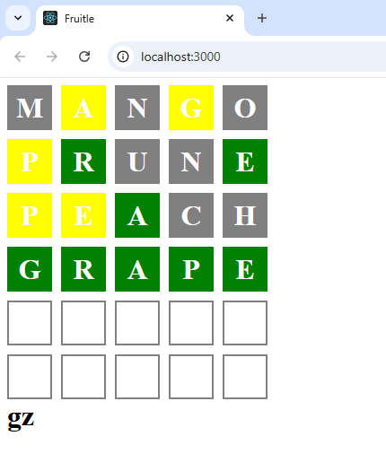

# Fruitle
Wordle but fruit

## 🔨 Installation:
1. `git clone git@github.com:deanfernandes/fruitle.git`
2. `npm -i`
3. `npm start`

##  🚀 How to play:
- Use keyboard to type letters
- Press enter to submit guess
- Use backspace to delete letter
